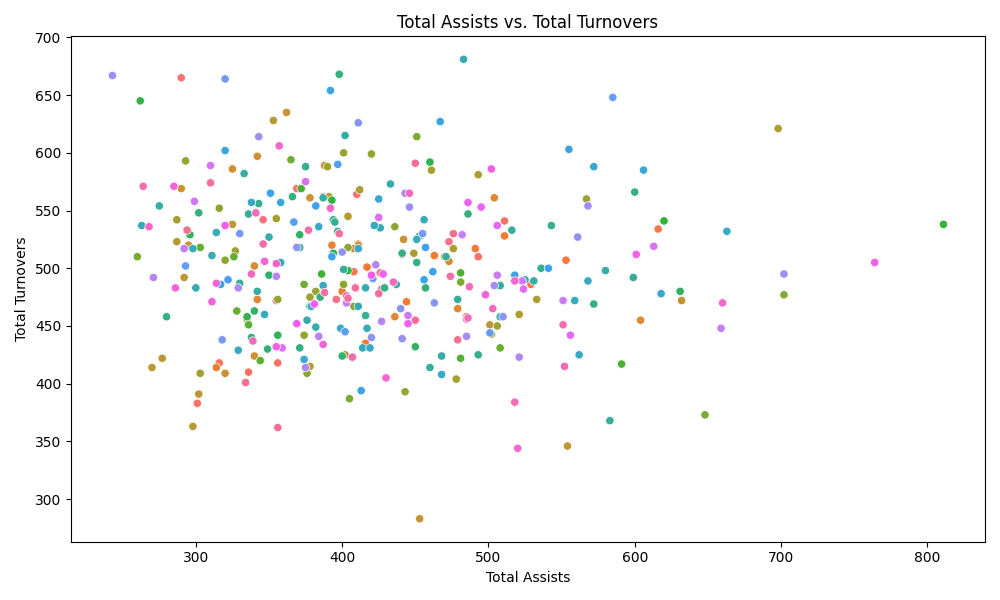
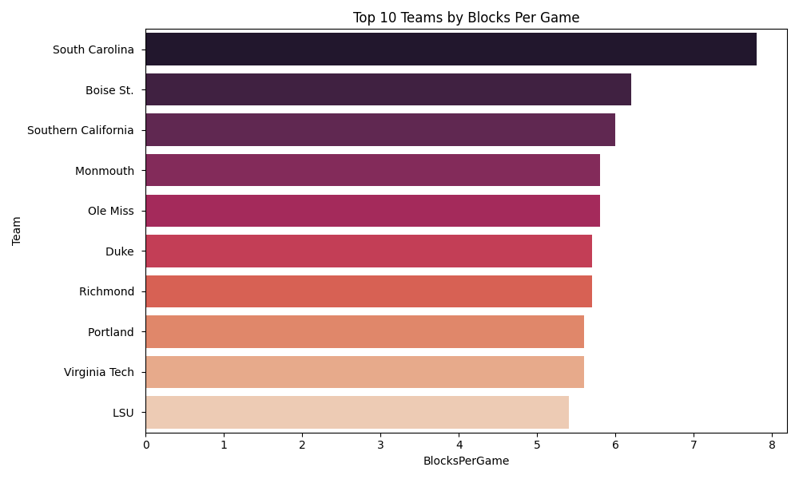
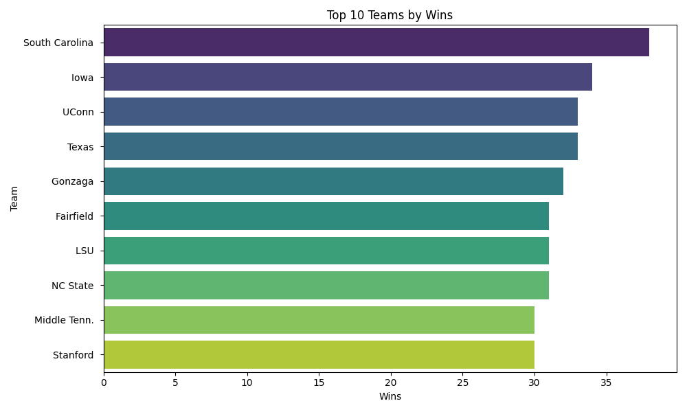
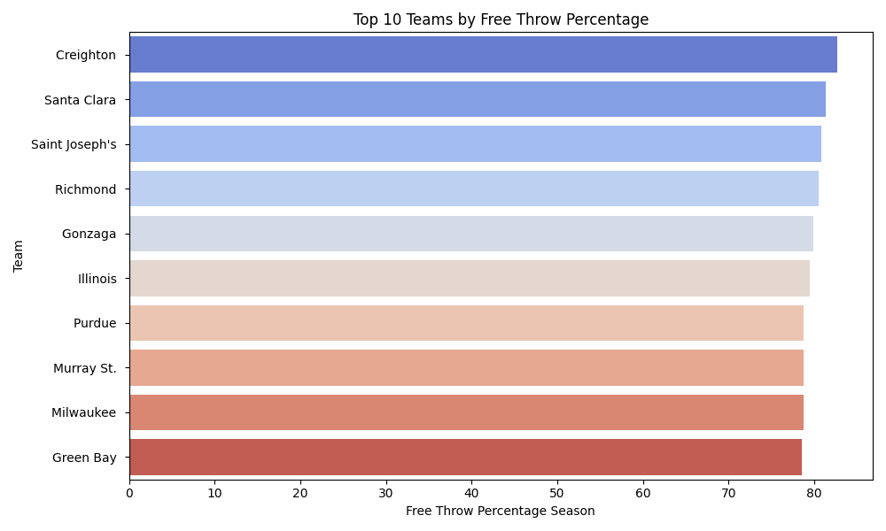
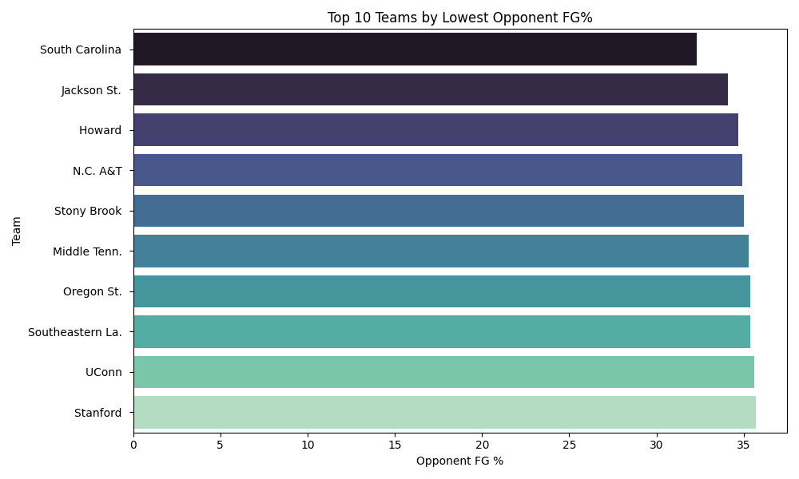

# Task_05_Descriptive_Stats

This project explores descriptive statistics using the 2023–2024 NCAA Division 1 Women’s Basketball dataset, combined with prompt engineering to interact with a Large Language Model (LLM) for question answering and insight generation.

## 📌 Objective

To analyze a small, real-world dataset using Python and challenge a Large Language Model (ChatGPT) with natural language questions about the data. The goal is to assess the LLM’s reasoning capabilities and support its responses with descriptive statistics and visualizations.

## 🗂️ Project Structure

```
task05-womens-basketball/
├── generate_stats.py                # Script to compute basic statistics
├── generate_visuals.py             # Script to generate visualizations
├── llm_prompts_and_responses.md    # Prompt engineering experiments with LLM
├── README.md                       # Project description and usage guide
├── subset.csv                      # Subset data used for analysis (NOT uploaded to GitHub)
├── WBBStatsFile01.csv              # Original dataset (NOT uploaded to GitHub)
├── *.png                           # Visualizations generated
└── venv/                           # Local virtual environment (not tracked)
```

## 📊 Visualizations

### Assists Vs Turnovers  


### Blocks Per Game Vs Teams  


### Wins Vs Teams  


### Free Throw Pct Vs Teams  


### Opponent Fg Pct Vs Teams  


These plots provide a breakdown of performance trends by teams on metrics like assists, blocks, free throws, opponent field goal %, and overall wins.

## 🤖 Prompt Engineering with LLMs

Natural language questions were posed to ChatGPT to infer team strengths and derive strategic insights. The following questions were asked:

- **Which team had the highest number of wins this season?**
- **Which team had the best Assist-to-Turnover Ratio?**
- **Which team allowed the lowest Opponent Field Goal Percentage?**
- **Which team had the highest Free Throw Percentage this season?**
- **Based on the data, if a coach wants to improve defense, which team’s stats should they study?**
- **Is there a correlation between Assist-to-Turnover Ratio and number of wins?**

Each response was validated manually using the Python-generated statistics from the scripts.

Read more in [`llm_prompts_and_responses.md`](llm_prompts_and_responses.md).

## 🧪 Methodology

1. **Data Analysis**:
   - Cleaned and analyzed the CSV data using `generate_stats.py`
   - Computed statistics such as wins, assists, turnovers, and shooting percentages

2. **Visualization**:
   - Created plots using `matplotlib` in `generate_visuals.py`

3. **LLM Evaluation**:
   - Posed contextual and strategic questions to ChatGPT
   - Tuned prompts to extract better reasoning
   - Compared answers with calculated metrics

4. **Validation**:
   - Verified model answers through visualization and statistics
   - Highlighted correct inferences and documented inaccuracies
  
## 🧠 Learning Insights

- **Prompt Design Matters**: Simple questions like "Which team had the most wins?" were answered correctly by ChatGPT. However, more complex or comparative questions required prompt tuning to guide the model toward accurate reasoning.

- **LLM Limitations**: The model occasionally made incorrect assumptions or averaged values without considering outliers. This highlighted the importance of validating LLM responses with actual computed statistics.

- **Data Context is Crucial**: For questions like "Who should a coach focus on to improve defense?", metrics like Opponent FG%, Blocks Per Game, and Turnovers needed to be defined clearly in the prompt for the LLM to reason effectively.

- **Visualization Enhanced Understanding**: Plots helped not only validate LLM responses but also surfaced patterns (e.g., assist-turnover correlations) that were not immediately obvious from raw data.

- **Python + LLM is Powerful**: Combining code-driven statistics with LLM reasoning offers a hybrid workflow where data science and AI augment each other — LLMs provide narrative explanations, while Python ensures accuracy.

- **Model Transparency**: This project emphasized the value of interpretability — understanding why an LLM gives a particular answer is as important as the answer itself, especially when used in analytical or decision-making contexts.


## 🔗 References

- [Original SU Women’s Basketball Stats](https://cuse.com/sports/2013/1/16/WLAX_0116134638)

